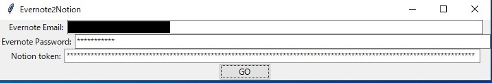

# TL;DR
Evernote内の**すべてのノート**をNotionのノートに変換し、Notionにインポートする。
本アプリは、[evernote-backup](https://github.com/vzhd1701/evernote-backup)、[enex2notion](https://github.com/vzhd1701/enex2notion)のラッパー（ラッパーにも満たない）アプリです。

# 使用方法
1. [Python 3](https://www.python.org/downloads/windows/)をインストールする。
2. [ここ](https://github.com/futonchan/evernote2notion-ui/releases/latest)から本アプリをZIP形式でダウンロードして解凍する。
3. [ここ](https://www.notion.so/How-to-get-your-token-d7a3421b851f406380fb9ff429cd5d47)を参考にNotionのtoken_v2をコピーする。
4. 本アプリの`evernote2notion.bat`を起動する
5. 本アプリに移行したいEvernoteアカウントの**Emailアドレス**, **パスワード**, **2.でコピーしたNotion token_v2**を入力する

6. 「GO」ボタンを押すと、EvernoteのすべてのノートブックがNotionへ移行する作業がスタートする。

# 動作環境
Python 3.8.3, Windows10

# 注意事項
長文メモ、画像など複雑なデータは時間がかかります。公式ツールや手動で事足りるなら、そちらの方がとても早いです。

リジューム機能はありません。

Notionの非公式なAPIを使っているらしく、いつまで利用できるかはわかりません。現時点(2022/12/18)では問題なく使えます。

ログが同フォルダの`enex2notion.log`というファイルで出力されます。Evernoteのタイトルなどに日本語が含まれているとログに文字化けが起きます。移行先のNotionには問題ありません。

# 参考
- [Evernoteのノートを画像も含めNotionへインポート - OITA: Oika's Information Technological Activities](https://oita.oika.me/2022/01/02/evernote-to-notion)

# 連絡
- [Googleフォーム](https://forms.gle/zu6GMYBmW8ysChr4A)
